```mermaid
  stateDiagram-v2
  1: S1
  2: S2
  3: S3
  1 --> 2 : 'a'
  1 --> 3 : ε
  2 --> 3 : 'b'
```

initial closure:
@immut/sorted_set.of([1: S1, 3: S3])
edges of initial closure:
@immut/sorted_set.of(['a'])
step of closure with 'a':
@immut/sorted_set.of([2: S2])
new edges
@immut/sorted_set.of(['b'])

